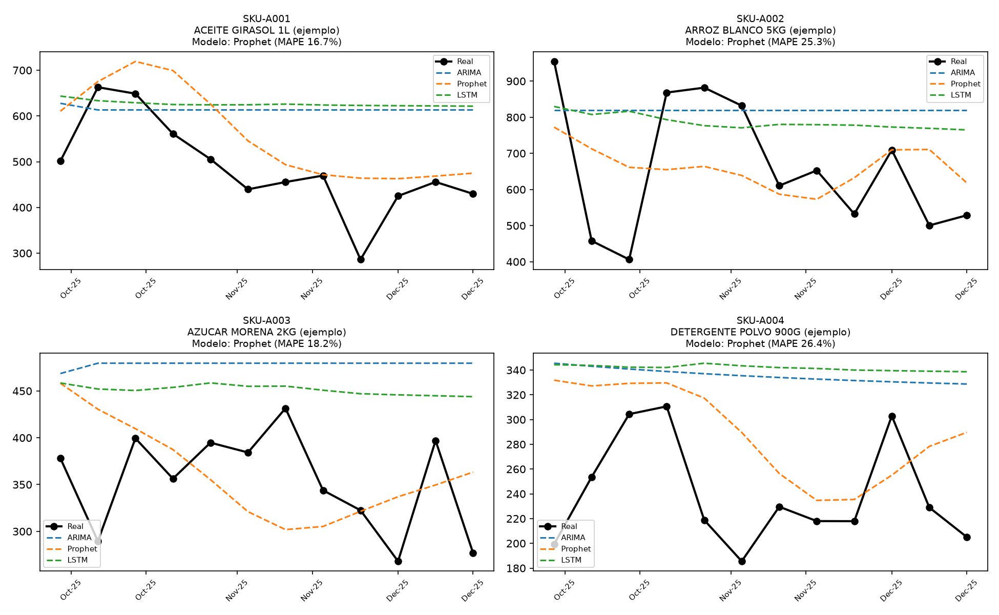
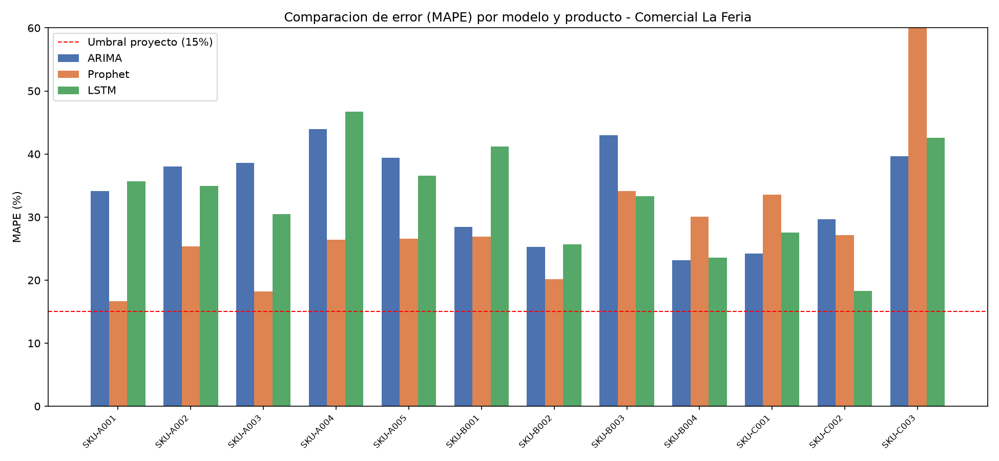
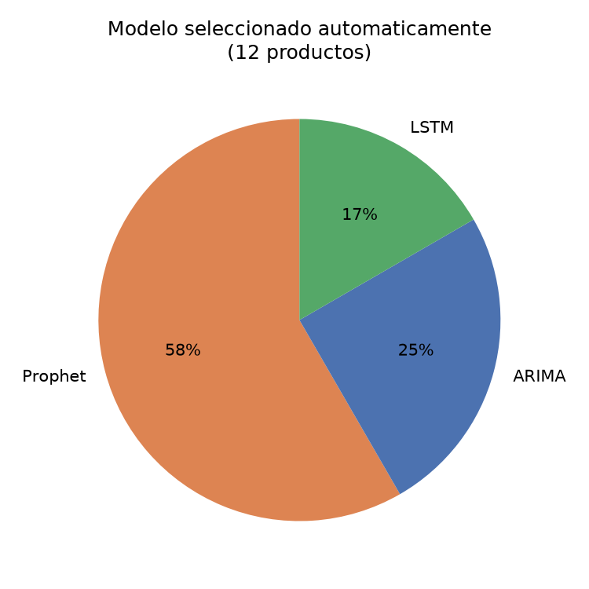
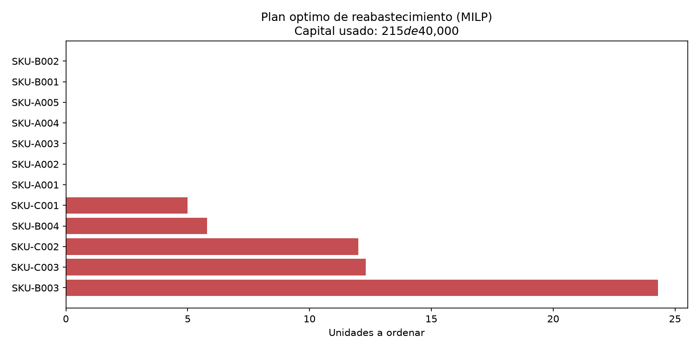
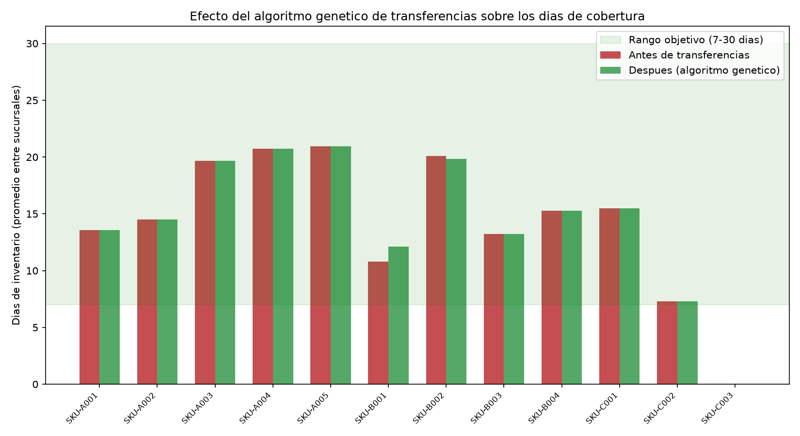

# Instrucciones de ejecución

Guía reproducible para instalar el prototipo, cargar un dataset de ejemplo,
ejecutar el pipeline completo (forecasting → optimización) y ver los
resultados **sin necesidad de base de datos ni credenciales**.

Probado en Windows 10/11, macOS y Linux con Python 3.10–3.12.

---

## 1. Requisitos

- **Python 3.10, 3.11 o 3.12** (TensorFlow aún no soporta bien 3.13).
  Verificar: `python3 --version`
- ~2 GB de espacio libre (TensorFlow y Prophet son paquetes grandes).
- No se requiere PostgreSQL para esta guía: se usa un dataset de ejemplo
  sintético.

---

## 2. Instalación

```bash
# 1. Clonar el repositorio
git clone <URL-del-repo> mia-inventory-forecasting-laferia
cd mia-inventory-forecasting-laferia

# 2. Crear y activar un entorno virtual
python3 -m venv venv
source venv/bin/activate          # Windows PowerShell:  venv\Scripts\Activate.ps1

# 3. Instalar dependencias (5–10 min la primera vez)
pip install -r requirements.txt
```

Sabrá que el entorno está activo porque el prompt muestra `(venv)`.

---

## 3. Cargar datos de ejemplo

En lugar de conectarse a PostgreSQL, se genera un dataset **sintético**
(12 productos, 90 semanas, 4 sucursales; datos ficticios, sin relación con
Comercial La Feria):

```bash
python src/sample_data/generate_sample.py
```

Salida esperada:

```
Escribiendo dataset de ejemplo (sintetico) en data/:
  data/parsed.json
  data/abc_classification.json
  data/stock_data.json
  data/prices.json
  data/demand_statistics.json
  data/warehouse_sale.json
  data/warehouses.json

Listo: 12 productos, 90 semanas, 4 sucursales.
```

Estos son exactamente los mismos archivos que produciría
`src/extraction/extract_data.py` contra la base real. Todo lo que el pipeline
lee y escribe vive en la carpeta `data/`.

---

## 4. Ejecutar el pipeline

Correr los comandos **en este orden**, desde la raíz del proyecto:

| # | Comando | Qué hace | Genera |
|---|---|---|---|
| 1 | `python src/forecasting/train_forecasting.py` | Entrena ARIMA, Prophet y LSTM por producto y selecciona el de menor MAPE | `data/model_comparison_results.csv`, `data/prediction_details.json` |
| 2 | `python src/forecasting/generate_charts.py` | Gráficos de comparación de modelos | `data/charts/grafico_comparacion_mape.png`, `…_distribucion_modelos.png`, `…_forecast_vs_real.png` |
| 3 | `python src/optimization/milp_reorder.py` | Optimizador MILP: punto de reorden y cantidad óptima de pedido | `data/resultado_milp_reorden.json` |
| 4 | `python src/optimization/ga_transfers.py` | Algoritmo genético: transferencias entre sucursales | `data/resultado_ga_transferencias.json` |
| 5 | `python src/optimization/generate_optimization_charts.py` | Gráficos del MILP y del algoritmo genético | `data/charts/grafico_plan_compra_milp.png`, `…_dias_inventario_ga.png` |

El paso 1 es el más largo (~3–5 min en el ejemplo, porque entrena 3 modelos
por producto). Los demás terminan en segundos.

### Salidas esperadas (dataset de ejemplo)

**Paso 1 — `train_forecasting.py`:**

```
=== SKU-A001 - ACEITE GIRASOL 1L (ejemplo) ===  (train=78, test=12)
  ARIMA   -> MAE=... RMSE=... MAPE=...%
  Prophet -> MAE=... RMSE=... MAPE=...%
  LSTM    -> MAE=... RMSE=... MAPE=...%
  >> Modelo seleccionado: Prophet (MAPE=16.7%)
...
================ RESUMEN FINAL ================
Distribucion del modelo seleccionado:
  Prophet    7
  ARIMA      3
  LSTM       2
MAPE promedio del modelo seleccionado: ~25%
```

**Paso 3 — `milp_reorder.py`:**

```
Producto          Stock actual   Punto reorden   Stock seguridad   Ordenar?
SKU-A001                  1,234           1,180                42         no
...
Estado de la solucion: Optimal
Costo total optimizado: $222.50
  -> ORDEN SKU-B003        :    24 unidades  (costo $110.86)
  ...
Capital usado: $215.29 de $40,000.00 (0.5%)
```

**Paso 4 — `ga_transfers.py`:**

```
Enabled transfer routes (6):
  MAYVE01 -> MATVE01
  ...
SUMMARY: 2 of 12 products require transfers
Total suggested movements: 2
```

---

## 5. Ver los resultados

Todo queda en la carpeta **`data/`**:

| Archivo | Contenido |
|---|---|
| `data/model_comparison_results.csv` | MAE / RMSE / MAPE de los 3 modelos por producto + modelo seleccionado. Abrir con Excel. |
| `data/resultado_milp_reorden.json` | Por producto: `reorder_point`, `order_quantity`, `order_cost_usd`, si se coloca orden. |
| `data/resultado_ga_transferencias.json` | Por producto: `transfer_plan` (origen → destino, cantidad), stock y días de inventario antes/después. |
| `data/charts/*.png` | 5 gráficos (ver abajo). |

### Capturas

> Reemplazar por capturas propias tras ejecutar el pipeline. Las imágenes de
> ejemplo están en `docs/img/`.

**Predicción — real vs. predicho por producto** (`data/charts/grafico_forecast_vs_real.png`)



**Comparación de MAPE por modelo** (`data/charts/grafico_comparacion_mape.png`)



**Distribución del modelo seleccionado** (`data/charts/grafico_distribucion_modelos.png`)



**Órdenes de compra — plan MILP** (`data/charts/grafico_plan_compra_milp.png`)



**Transferencias — días de inventario antes/después** (`data/charts/grafico_dias_inventario_ga.png`)



---

## 6. (Opcional) Ejecución con datos reales

Con acceso a la base PostgreSQL de Comercial La Feria:

```bash
cp .env.example .env        # completar DB_HOST, DB_PORT, DB_NAME, DB_USER, DB_PASSWORD
python src/extraction/extract_data.py      # reemplaza el paso 3 (genera data/*.json desde la BD)
# luego los pasos 1, 2, 4, 5 igual que arriba
```

Para el catálogo completo (miles de productos) en un servidor, usar
`src/forecasting/train_forecasting_tiered.py` en lugar de
`train_forecasting.py` (ver README, sección "Los dos tracks del pipeline").

---

## Problemas comunes

| Error | Solución |
|---|---|
| `ModuleNotFoundError` | El entorno virtual no está activado, o falta `pip install -r requirements.txt` |
| `FileNotFoundError: data/parsed.json` | Ejecutar primero `python src/sample_data/generate_sample.py` |
| `prophet` no instala en Windows | Instalar "Visual Studio Build Tools" o usar WSL |
| El LSTM tarda | Normal: TensorFlow en CPU, ~10–15 s por producto |
